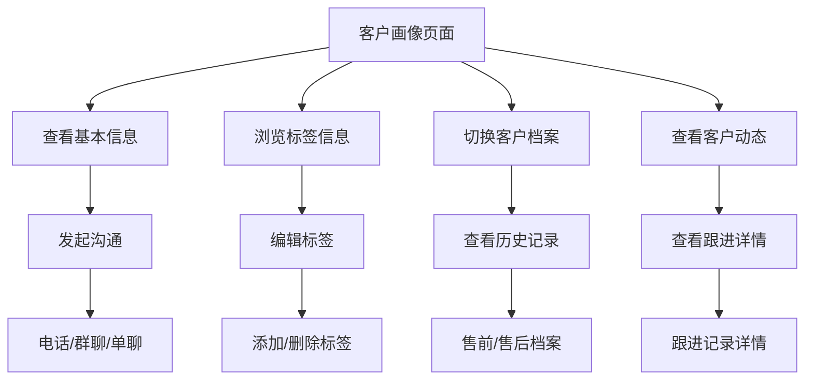

## 1. 产品概述
客户画像移动端页面是奥迪企业微信客户管理系统的核心功能模块，用于展示客户详细信息、标签体系、业务状态及交互记录。该页面为销售顾问提供360度客户视图，支持快速了解客户背景、跟进状态和历史互动。

目标客户群体为奥迪经销商的销售顾问和客户服务人员，通过移动端随时随地访问客户信息，提升客户服务效率和销售转化率。

## 2. 核心功能

### 2.1 用户角色
| 角色 | 注册方式 | 核心权限 |
|------|----------|----------|
| 销售顾问 | 企业微信授权登录 | 查看客户画像、编辑标签、记录跟进、发起沟通 |
| 客户服务 | 企业微信授权登录 | 查看客户信息、更新业务状态、处理客户动态 |
| 销售经理 | 企业微信授权登录 | 查看团队客户数据、审核跟进记录、数据分析 |

### 2.2 功能模块
客户画像页面包含以下核心模块：
1. **客户画像页面**：顶部状态栏、客户基本信息卡片、标签展示区、客户档案切换、客户动态列表、底部操作栏

### 2.3 页面详情
| 页面名称 | 模块名称 | 功能描述 |
|-----------|-------------|-------------|
| 客户画像 | 状态栏 | 显示系统时间16:55、信号强度、WiFi连接状态、电池电量100%绿色圆环 |
| 客户画像 | 页面头部 | 左侧返回按钮(×图标)、居中标题"客户画像"、黑色文字加粗显示 |
| 客户画像 | 客户信息卡片 | 蓝色渐变背景(深蓝到浅蓝)、圆角白色卡片、左侧圆形头像、姓名"李贤"加粗显示、副标签"姓名：李贤"灰色文字、右侧"客户详情"蓝色链接 |
| 客户画像 | 联系信息行 | 左侧"手机号：16601515280"、右侧"性别：男"灰色文字标签 |
| 客户画像 | 快捷操作栏 | 三个图标按钮：电话(左)、群聊(中)、单聊(右)、图标配文字标签、中等灰色 |
| 客户画像 | 标签区域 | 标题"标签"配标签图标、右侧"查看全部"蓝色链接、"＋打标签"和"编辑展示标签组"两个边框按钮 |
| 客户画像 | 基础信息标签 | 浅蓝色胶囊标签：企微添加时间_7月、企微添加时间_4日、企微添加时间_2025年、客户类型_私人、是否会员绑定_否 |
| 客户画像 | 业务状态标签 | 红色胶囊：留资状态_有手机号；黄色胶囊：线索状态_无效、到店状态_未到店、试驾次数_2次 |
| 客户画像 | 营销偏好标签 | 黄色胶囊：活动标签_活动参与 |
| 客户画像 | 车辆信息标签 | 浅蓝色胶囊：全网上次回厂时间_2026年、全网上次回厂时间_1日、全网上次保养时间_2024年、全网上次保养时间_21日 |
| 客户画像 | 客户档案卡片 | 圆角白色卡片配灰色边框、Tab切换栏：售前线索(激活蓝线)、潜客、售后线索、车主档案 |
| 客户画像 | 客户档案内容 | 空状态显示"没有更多数据了"浅灰色居中文字 |
| 客户画像 | 客户动态卡片 | 圆角白色卡片、人员图标配标题、Tab栏：全部(激活)、线索跟进、好友跟进、潜客跟进、好友浏览、活动 |
| 客户画像 | 动态列表项 | 左侧蓝色旗标图标、标题"活动参与记录"黑色文字、时间戳"2026-03-05 18:21:35"灰色右对齐、描述"生产验证优化无参与"灰色文字 |
| 客户画像 | 底部操作栏 | 左侧"写好友跟进"白色边框按钮配钢笔图标、右下角浮动黑色圆形按钮配白色聊天气泡图标"待办" |
| 客户画像 | 底部导航 | 左右箭头按钮(< >)黑色图标 |

## 3. 核心流程
用户操作流程：
1. 用户通过企业微信进入客户画像页面
2. 系统加载客户基本信息、标签数据、档案记录和动态信息
3. 用户可查看客户完整画像信息，包括基础资料、业务标签、车辆信息
4. 用户可通过快捷操作发起电话、群聊或单聊
5. 用户可切换查看不同类型的客户档案和动态记录
6. 用户可执行跟进记录和待办事项操作

## 4. 用户界面设计

### 4.1 设计风格
- **主色调**：蓝色渐变(深蓝#0052D9到浅蓝#4096FF)、白色背景
- **辅助色**：红色#FF4D4F、黄色#FAAD14、绿色#52C41A
- **按钮样式**：圆角矩形、边框按钮、浮动圆形按钮
- **字体**：系统默认字体、标题加粗、正文字号适中
- **布局风格**：卡片式布局、信息分组清晰、留白充足
- **图标风格**：线性图标、简洁现代、统一风格

### 4.2 页面设计概述
| 页面名称 | 模块名称 | UI元素 |
|-----------|-------------|-------------|
| 客户画像 | 整体布局 | 移动端优先、375-414px宽度适配、禁止横向滚动、垂直滚动流畅 |
| 客户画像 | 状态栏 | 黑色文字、图标简洁、电池图标绿色圆环100%电量 |
| 客户画像 | 头部导航 | 黑色标题加粗、返回按钮×符号、居中对称布局 |
| 客户画像 | 信息卡片 | 蓝色渐变背景、白色圆角卡片、头像圆形裁剪、信息层次清晰 |
| 客户画像 | 标签系统 | 胶囊式标签、圆角设计、颜色区分状态、可点击交互 |
| 客户画像 | 卡片容器 | 白色圆角卡片、浅灰色边框、内边距适中、阴影轻微 |
| 客户画像 | Tab切换 | 底部蓝色下划线标识激活状态、文字颜色区分、切换流畅 |
| 客户画像 | 操作按钮 | 边框按钮白色背景、黑色文字、图标配套、浮动按钮黑色圆形 |
| 客户画像 | 空状态 | 浅灰色文字、居中显示、字体大小适中、视觉平衡 |

### 4.3 响应式设计
- **设备适配**：优先移动端设计，完美适配375-414px宽度范围
- **断点设计**：375px(iPhone SE)、390px(iPhone 12/13/14)、414px(iPhone Plus)
- **触摸优化**：按钮最小44px点击区域、滑动交互流畅、手势支持
- **字体缩放**：支持系统字体大小设置、保证可读性
- **图片适配**：支持@2x/@3x高清显示、SVG图标矢量无损

### 4.4 交互状态设计
- **按钮状态**：默认状态、点击状态(200ms ease-out缩放)、禁用状态、加载状态
- **标签交互**：可点击标签悬停效果、选中状态视觉反馈
- **卡片交互**：点击反馈、滑动切换、手势操作支持
- **动画效果**：按钮缩放200ms ease-out、抽屉滑入300ms ease-in-out、页面转场流畅
- **加载状态**：骨架屏加载、渐进式内容显示、网络错误处理
- **空状态**：无数据提示、引导操作、友好文案

## 5. 性能与质量要求
- **加载性能**：首屏加载<2秒、图片懒加载、代码分割优化
- **交互性能**：按钮响应<100ms、滚动流畅60fps、动画流畅无卡顿
- **兼容性**：iOS Safari 12+、Android Chrome 80+、微信内置浏览器
- **可访问性**：支持屏幕阅读器、键盘导航、色彩对比度达标
- **SEO优化**：合理的标题结构、meta标签优化、结构化数据
- **Chrome Lighthouse**：性能评分≥95分、可访问性≥95分、最佳实践≥95分