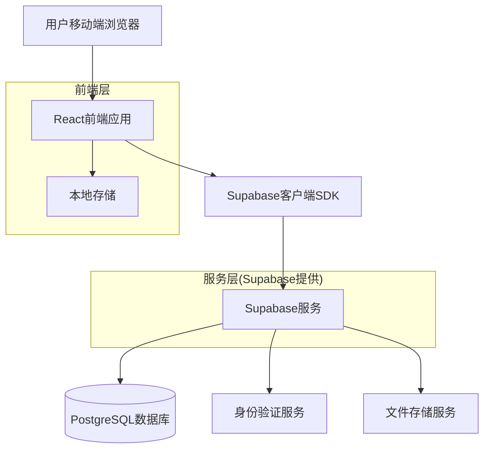
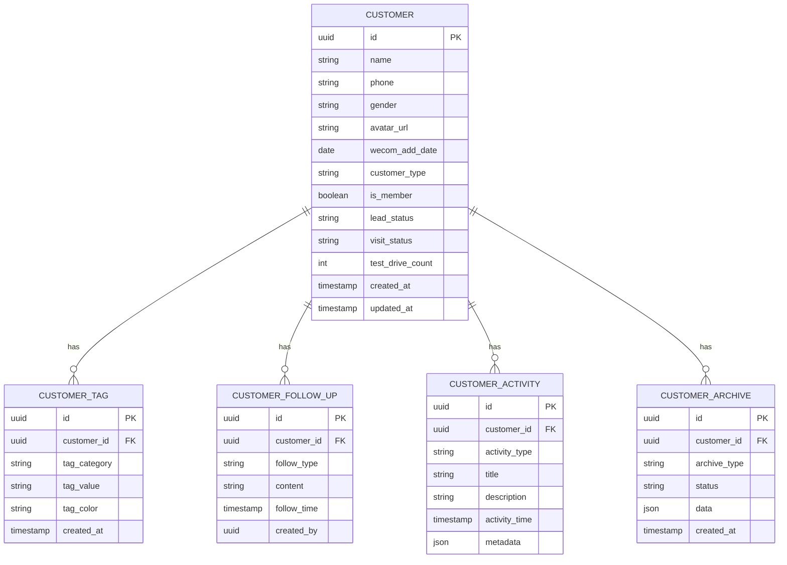
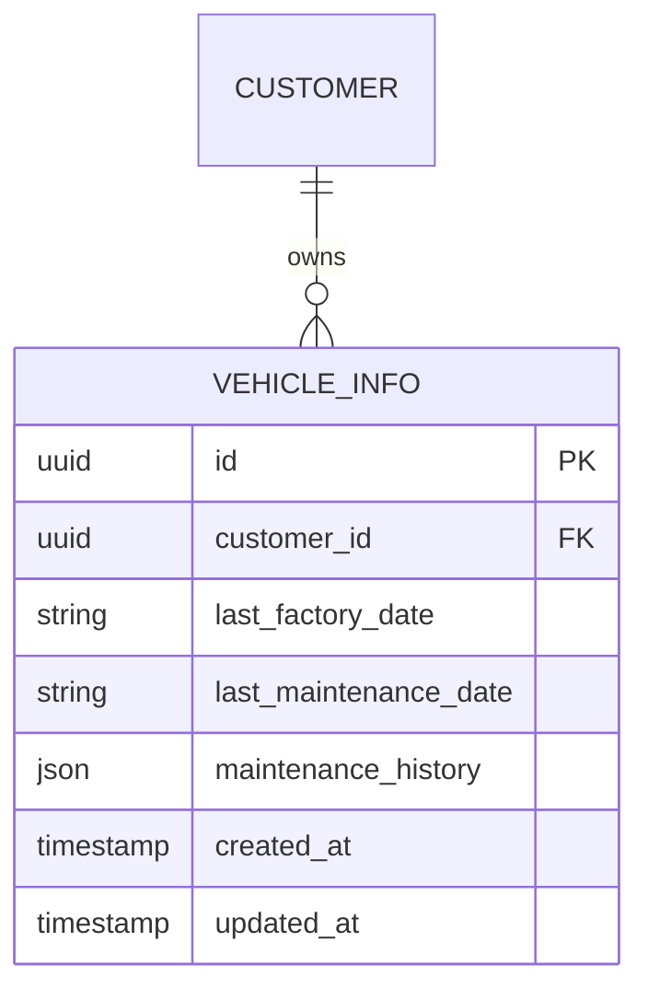
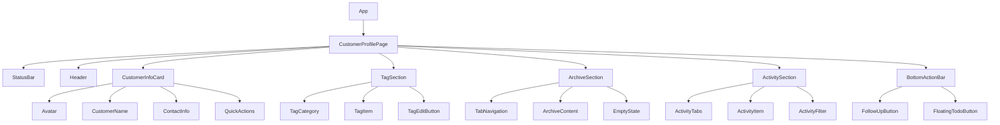

## 1. 架构设计



## 2. 技术描述
- **前端框架**: React@18 + TypeScript@5 + Vite@5
- **初始化工具**: vite-init
- **样式方案**: TailwindCSS@3 + CSS Modules
- **状态管理**: React Context + useReducer
- **数据获取**: Supabase客户端SDK + React Query
- **动画库**: Framer Motion@11
- **图标库**: Lucide React + 自定义SVG
- **移动端适配**: react-device-detect + viewport-units-polyfill
- **构建优化**: Vite PWA插件 + 代码分割
- **后端服务**: Supabase (无需自建后端)

## 3. 路由定义
| 路由路径 | 页面用途 |
|----------|----------|
| /customer/:id | 客户画像详情页，展示客户完整信息 |
| /customer/:id/edit | 客户信息编辑页，修改基础资料 |
| /customer/:id/tags | 标签管理页，编辑客户标签 |
| /customer/:id/follow-up | 跟进记录页，添加跟进记录 |
| /customer/:id/todo | 待办事项页，管理客户待办 |

## 4. 数据模型定义

### 4.1 客户信息表 (customers)


### 4.2 车辆信息表 (vehicle_info)


## 5. 数据库定义语言

### 5.1 客户基础表
```sql
-- 客户主表
CREATE TABLE customers (
  id UUID PRIMARY KEY DEFAULT gen_random_uuid(),
  name VARCHAR(100) NOT NULL,
  phone VARCHAR(20) UNIQUE NOT NULL,
  gender VARCHAR(10) CHECK (gender IN ('男', '女')),
  avatar_url TEXT,
  wecom_add_date DATE,
  customer_type VARCHAR(50) DEFAULT '私人',
  is_member BOOLEAN DEFAULT false,
  lead_status VARCHAR(50) DEFAULT '无效',
  visit_status VARCHAR(50) DEFAULT '未到店',
  test_drive_count INTEGER DEFAULT 0,
  created_at TIMESTAMP WITH TIME ZONE DEFAULT NOW(),
  updated_at TIMESTAMP WITH TIME ZONE DEFAULT NOW()
);

-- 客户标签表
CREATE TABLE customer_tags (
  id UUID PRIMARY KEY DEFAULT gen_random_uuid(),
  customer_id UUID REFERENCES customers(id) ON DELETE CASCADE,
  tag_category VARCHAR(50) NOT NULL,
  tag_value VARCHAR(100) NOT NULL,
  tag_color VARCHAR(20) DEFAULT 'blue',
  created_at TIMESTAMP WITH TIME ZONE DEFAULT NOW()
);

-- 跟进记录表
CREATE TABLE customer_follow_ups (
  id UUID PRIMARY KEY DEFAULT gen_random_uuid(),
  customer_id UUID REFERENCES customers(id) ON DELETE CASCADE,
  follow_type VARCHAR(50) NOT NULL,
  content TEXT NOT NULL,
  follow_time TIMESTAMP WITH TIME ZONE DEFAULT NOW(),
  created_by UUID REFERENCES auth.users(id),
  created_at TIMESTAMP WITH TIME ZONE DEFAULT NOW()
);

-- 客户动态表
CREATE TABLE customer_activities (
  id UUID PRIMARY KEY DEFAULT gen_random_uuid(),
  customer_id UUID REFERENCES customers(id) ON DELETE CASCADE,
  activity_type VARCHAR(50) NOT NULL,
  title VARCHAR(200) NOT NULL,
  description TEXT,
  activity_time TIMESTAMP WITH TIME ZONE DEFAULT NOW(),
  metadata JSONB DEFAULT '{}',
  created_at TIMESTAMP WITH TIME ZONE DEFAULT NOW()
);

-- 车辆信息表
CREATE TABLE vehicle_info (
  id UUID PRIMARY KEY DEFAULT gen_random_uuid(),
  customer_id UUID REFERENCES customers(id) ON DELETE CASCADE,
  last_factory_date VARCHAR(50),
  last_maintenance_date VARCHAR(50),
  maintenance_history JSONB DEFAULT '[]',
  created_at TIMESTAMP WITH TIME ZONE DEFAULT NOW(),
  updated_at TIMESTAMP WITH TIME ZONE DEFAULT NOW()
);

-- 客户档案表
CREATE TABLE customer_archives (
  id UUID PRIMARY KEY DEFAULT gen_random_uuid(),
  customer_id UUID REFERENCES customers(id) ON DELETE CASCADE,
  archive_type VARCHAR(50) NOT NULL,
  status VARCHAR(50) DEFAULT 'active',
  data JSONB DEFAULT '{}',
  created_at TIMESTAMP WITH TIME ZONE DEFAULT NOW()
);

-- 创建索引
CREATE INDEX idx_customers_phone ON customers(phone);
CREATE INDEX idx_customers_name ON customers(name);
CREATE INDEX idx_customer_tags_customer_id ON customer_tags(customer_id);
CREATE INDEX idx_customer_tags_category ON customer_tags(tag_category);
CREATE INDEX idx_follow_ups_customer_id ON customer_follow_ups(customer_id);
CREATE INDEX idx_activities_customer_id ON customer_activities(customer_id);
CREATE INDEX idx_activities_time ON customer_activities(activity_time DESC);
CREATE INDEX idx_vehicle_info_customer_id ON vehicle_info(customer_id);
```

### 5.2 Supabase权限设置
```sql
-- 基础读取权限
GRANT SELECT ON customers TO anon;
GRANT SELECT ON customer_tags TO anon;
GRANT SELECT ON customer_activities TO anon;
GRANT SELECT ON vehicle_info TO anon;

-- 认证用户完整权限
GRANT ALL PRIVILEGES ON customers TO authenticated;
GRANT ALL PRIVILEGES ON customer_tags TO authenticated;
GRANT ALL PRIVILEGES ON customer_follow_ups TO authenticated;
GRANT ALL PRIVILEGES ON customer_activities TO authenticated;
GRANT ALL PRIVILEGES ON vehicle_info TO authenticated;
GRANT ALL PRIVILEGES ON customer_archives TO authenticated;

-- RLS策略示例
ALTER TABLE customers ENABLE ROW LEVEL SECURITY;
ALTER TABLE customer_tags ENABLE ROW LEVEL SECURITY;
ALTER TABLE customer_follow_ups ENABLE ROW LEVEL SECURITY;

-- 客户数据访问策略
CREATE POLICY "Users can view their customers" ON customers
  FOR SELECT USING (
    EXISTS (
      SELECT 1 FROM auth.users 
      WHERE auth.uid() = auth.users.id
    )
  );

CREATE POLICY "Users can manage their customers" ON customers
  FOR ALL USING (
    auth.uid() IS NOT NULL
  );
```

## 6. 组件架构设计

### 6.1 核心组件结构


### 6.2 状态管理设计
```typescript
// 客户状态类型定义
interface CustomerState {
  customer: Customer | null;
  tags: CustomerTag[];
  activities: Activity[];
  archives: Archive[];
  loading: boolean;
  error: string | null;
  activeTab: string;
  filters: FilterState;
}

// 动作类型定义
type CustomerAction = 
  | { type: 'SET_CUSTOMER'; payload: Customer }
  | { type: 'SET_TAGS'; payload: CustomerTag[] }
  | { type: 'SET_ACTIVITIES'; payload: Activity[] }
  | { type: 'SET_LOADING'; payload: boolean }
  | { type: 'SET_ERROR'; payload: string }
  | { type: 'SET_ACTIVE_TAB'; payload: string }
  | { type: 'ADD_TAG'; payload: CustomerTag }
  | { type: 'REMOVE_TAG'; payload: string };
```

## 7. 性能优化策略

### 7.1 加载优化
- **代码分割**: 按路由和组件懒加载
- **图片优化**: WebP格式、响应式图片、懒加载
- **缓存策略**: React Query缓存、Service Worker缓存
- **预加载**: 关键资源预加载、下屏内容预加载

### 7.2 渲染优化
- **虚拟滚动**: 长列表虚拟滚动
- **防抖节流**: 搜索输入防抖、滚动事件节流
- **Memo优化**: 组件级Memo、计算值缓存
- **动画优化**: GPU加速、will-change属性

### 7.3 打包优化
- **Tree Shaking**: 消除未使用代码
- **压缩优化**: Gzip/Brotli压缩、图片压缩
- **CDN加速**: 静态资源CDN分发
- **PWA支持**: 离线访问、添加到主屏

## 8. 测试与质量保障

### 8.1 测试策略
- **单元测试**: Jest + React Testing Library
- **集成测试**: Playwright端到端测试
- **视觉回归**: Chromatic截图对比
- **性能测试**: Lighthouse CI集成
- **可访问性**: axe-core自动化测试

### 8.2 质量标准
- **性能指标**: FCP < 1.8s、LCP < 2.5s、CLS < 0.1
- **可访问性**: WCAG 2.1 AA标准、键盘导航完整
- **浏览器兼容**: iOS Safari 12+、Android Chrome 80+
- **网络兼容**: 3G网络可用、离线功能完整
- **Lighthouse评分**: 性能≥95、可访问性≥95、最佳实践≥95